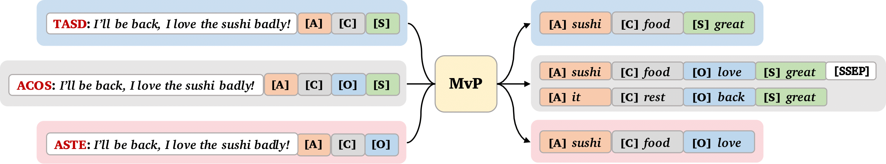
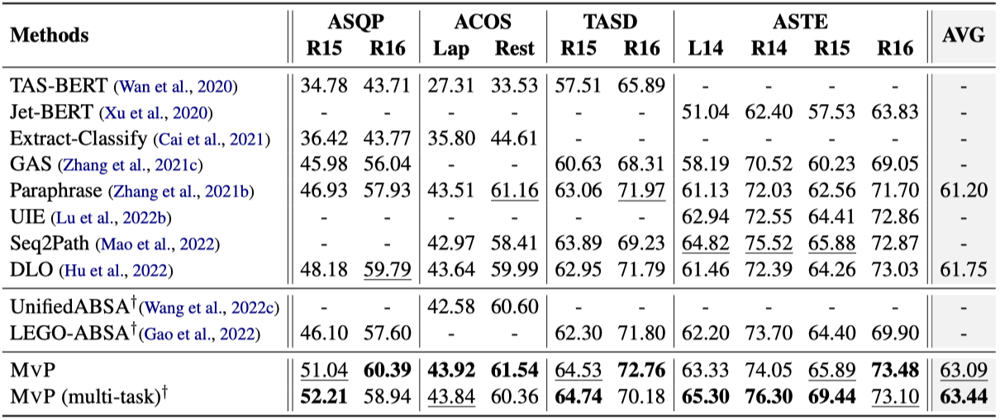
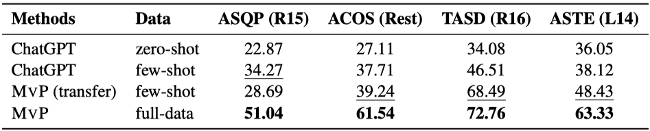

<h1 align="center">
Multi-view Prompting (MvP)
</h1>

<div align="center">


[](https://paperswithcode.com/sota/aspect-based-sentiment-analysis-absa-on-acos?p=mvp-multi-view-prompting-improves-aspect)
<br>
[](https://paperswithcode.com/sota/aspect-based-sentiment-analysis-absa-on-asqp?p=mvp-multi-view-prompting-improves-aspect)
<br>
[](https://paperswithcode.com/sota/aspect-based-sentiment-analysis-absa-on-aste?p=mvp-multi-view-prompting-improves-aspect)
<br>
[](https://paperswithcode.com/sota/aspect-based-sentiment-analysis-absa-on-tasd?p=mvp-multi-view-prompting-improves-aspect)

</div>

<p align="center">
  <a href="#-quick-start">Quick Start</a> •
  <a href="#-trained-model">Trained Model</a> •
  <a href="https://arxiv.org/abs/2305.12627">Paper</a> •
  <a href="#%EF%B8%8F-citation">Citation</a>
</p>


Repo for ACL 2023 paper [MvP: Multi-view Prompting Improves Aspect Sentiment Tuple Prediction](https://arxiv.org/abs/2305.12627).

## ✨ Introduction 

MvP is an element order-based prompt learning method:

- MvP unifies various tuple prediction tasks through the **combination of elements**:


<p align="center">
    
</p>

- MvP aggregates multi-view results by considering **permutations of elements**:

<p align="center">
    
</p>


## 🎯 Results

MvP achieves **state-of-the-art** performance across 10 datasets encompassing 4 ABSA tasks with a **single** model:

<p align="center">
    
</p>

MvP with T5-base outperforms large language models ChatGPT (*gpt-3.5-turbo*) by a large margin, even in **few-shot** transfer settings:

<p align="center">
    
</p>

## 🚀 Quick Start


### ⚙️ Setup

```sh
conda create -n mvp python=3.8
conda activate mvp
pip install torch==1.12.1+cu116 torchvision==0.13.1+cu116 torchaudio==0.12.1 --extra-index-url https://download.pytorch.org/whl/cu116
pip install -r requirements.txt
```

### 🤖 Trained Model

We release the multi-task MvP model (one seed): `mvp-unified-base` [[Google Drive]](https://drive.google.com/file/d/1FMTuS4DRquLjZ3xWHLDh25W31d4dgQph/view)

You may download the model with [gdown](https://github.com/wkentaro/gdown) (`pip install gdown`):
```sh
pip install gdown
mkdir -p outputs && cd outputs
gdown 1FMTuS4DRquLjZ3xWHLDh25W31d4dgQph
tar -xvf unified_model.tar.gz
mv src/outputs/unified unified
cd ..
```

then run evaluation:

```sh
bash scripts/eval_unified.sh
```

then you will get following results in `outputs/unified/top5_seed10/result.txt`:
<small>
```
aste:  laptop14:  precision: 67.64 recall: 64.14 F1 = 65.84
aste:  rest14:  precision: 74.49 recall: 77.73 F1 = 76.08
aste:  rest15:  precision: 68.73 recall: 71.13 F1 = 69.91
aste:  rest16:  precision: 72.15 recall: 72.57 F1 = 72.36
tasd:  rest15:  precision: 69.88 recall: 62.60 F1 = 66.04
tasd:  rest16:  precision: 70.15 recall: 67.57 F1 = 68.84
acos:  laptop16:  precision: 44.75 recall: 44.64 F1 = 44.69
acos:  rest16:  precision: 60.86 recall: 59.84 F1 = 60.35
asqp:  rest15:  precision: 54.77 recall: 54.84 F1 = 54.81
asqp:  rest16:  precision: 58.29 recall: 60.70 F1 = 59.47
Average F1:  63.83899277391693
```
</small>


### ⚡️ Training

- Train unified models:

```sh
bash scripts/process_unify.sh  # process data
bash scripts/run_unified.sh
```

- Train separate models:

```sh
bash scripts/run_main.sh
```

- Train with low-resource or cross-task transfer settings:
```sh
bash scripts/run_low_resource.sh
```

- Evaluate ChatGPT (*gpt-3.5-turbo*) baselines:
```sh
bash scripts/run_llms.sh
python llms/eval.py
```


## ☕️ Citation

If you find this repository helpful, please consider citing our paper:

```
@inproceedings{gou-etal-2023-mvp,
    title = "{M}v{P}: Multi-view Prompting Improves Aspect Sentiment Tuple Prediction",
    author = "Gou, Zhibin  and
      Guo, Qingyan  and
      Yang, Yujiu",
    booktitle = "Proceedings of the 61st Annual Meeting of the Association for Computational Linguistics (Volume 1: Long Papers)",
    month = jul,
    year = "2023",
    address = "Toronto, Canada",
    publisher = "Association for Computational Linguistics",
    url = "https://aclanthology.org/2023.acl-long.240",
    pages = "4380--4397",
}
```
